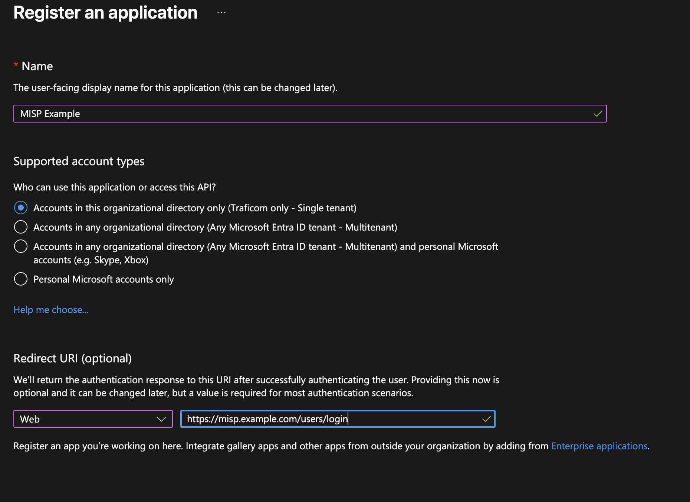
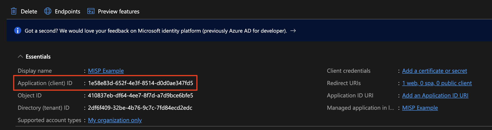
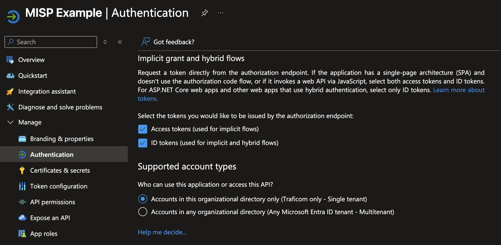
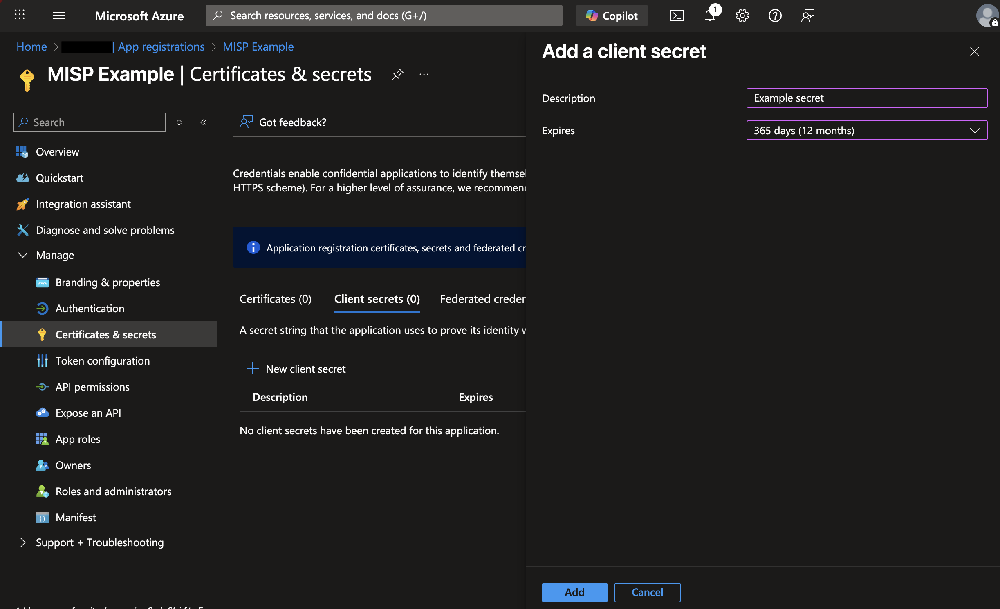
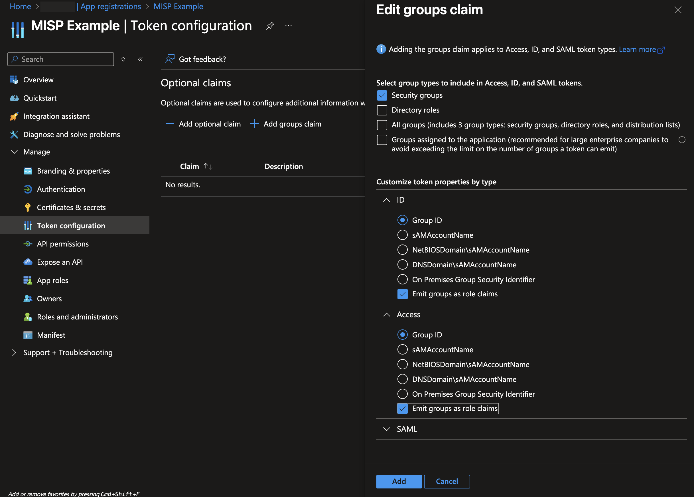
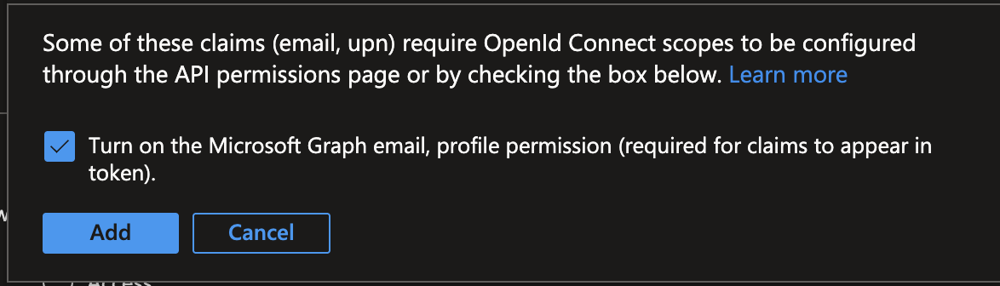
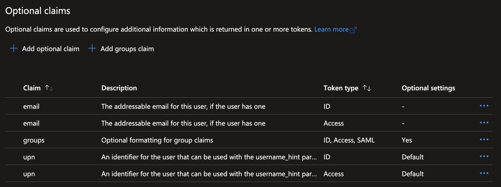
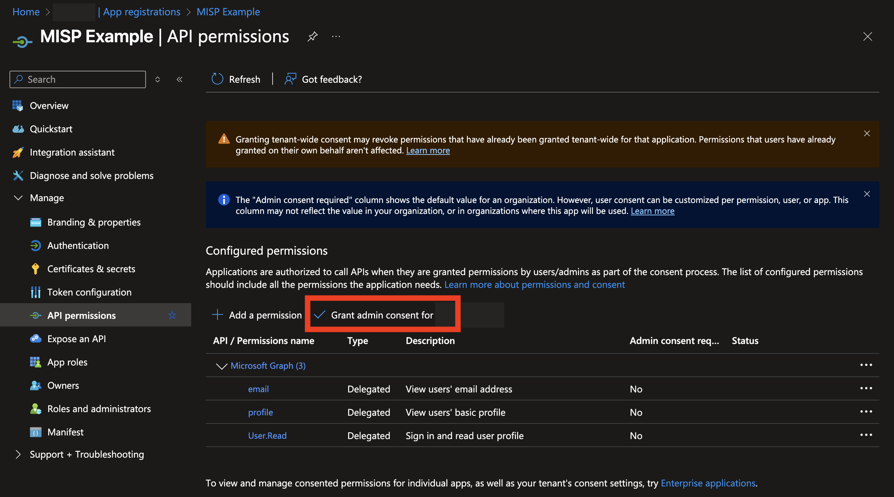

# MISP Entra ID OIDC Setup

## Register OIDC application

Go to https://portal.azure.com/#view/Microsoft_AAD_IAM/ActiveDirectoryMenuBlade/~/RegisteredApps and choose `New registration`.

- Enter the name for the application
- Set `Supported account types` to `Accounts in this organizational directory only (Single tenant)`
- Set redirect URI to the address of planned MISP instance suffixed with `/users/login` e.g. `https://misp.example.com/users/login`.

Click `Register`.

Make note of the client id on the next screen.

Click on `Endpoints` button and make note of the URL of `OpenID Connect metadata document`.

Open the URL and make note of `end_session_endpoint` and `issuer`.

## Setup authentication settings

Choose `Authentication` in the left menu. Select both token types under `Implicit grant and hybrid flows` and `Save`.

## Create a client secret

Choose `Certificates and Secrets` in the left hand side menu. Select `New client secret` under `Client secrets`.

- Give the secret a name
- Define the expiration according to organizational policies and document the renewal.

Click `Add`.

Make note of the client secret once it's created.

## Configure the token

The purpose of the token configuration is to define a Entra ID group that will be assigned the administrative permissions for MISP.

Go to `Token configuration` in the left hand side menu and click on `Add groups claim`.

- Check `Security groups`
- Choose `Group ID` under `ID` and `Access`. Group ID is immutable, so it persists over group name changes.
- Select `Emit groups as role claims`

Click `Add`.

Then add `email` and `upn` claims. Choose `Add optional claim`, set type to `ID` and select `email` and `upn` and click `Add`.

The UI asks whether to enable Graph API. Tick the box and click `Add`.

Repeat the process for token type `Access`. The result should be:

## API Permissions

Go to `API permissions` in the left hand menu. Choose `Grant admin consent for Organization`.

## Groups configuration

Go to Entra ID groups and find the group that contains the personnel designated to be administrators in MISP. Make note of the group `Object ID`.

## Complete OIDC config in `terraform.tfvars`

Complete following variables based on information above:

- `OIDC_CLIENT_ID`
- `OIDC_CLIENT_SECRET`
- `OIDC_ISSUER`
- `OIDC_LOGOUT_URL`
- `OIDC_PROVIDER_URL`
- `OIDC_ROLES_MAPPING`

Deploy!
